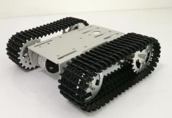

<!-- START doctoc -->
**Table of Contents**

- [Project Structure](#project-structure)
- [Documentation](#documentation)
- [Copyright and Licence](#copyright-and-licence)
<!-- END doctoc -->

An autonomous tracked mobile robot platform built on the all-metal T101 aluminum chassis, powered by an Uno+WiFi R3 (ATmega328P + ESP8266) dual-processor board, L293D motor driver shield, and modular embedded C firmware adhering to SOLID and Hexagonal architecture principles.

### PROJECT STRUCTURE

The **trackedbot** project is organized into three decoupled layers:

- **[body/](body/README.md)** – Mechanical chassis, physical specs, track sizing, and assembly guide.
- **[hw/](hw/README.md)** – Hardware schematics, Uno+WiFi R3, L293D shield, master pinout, and power distribution.
- **[sw/](sw/README.md)** – Embedded C firmware architecture, SOLID design, ports & adapters, and drivers.

### DOCS

More documentation and info at:
* **Mechanical Architecture:** [body/README.md](body/README.md)
* **Hardware & Electrical Architecture:** [hw/README.md](hw/README.md)
* **Software Architecture:** [sw/README.md](sw/README.md)
* [https://trackedbot.readthedocs.io/en/latest/](https://trackedbot.readthedocs.io/en/latest/)

### COPYRIGHT AND LICENCE

 

Copyright (C) 2020 - 2026 by [dof2bot.github.io/trackedbot](https://dof2bot.github.io/trackedbot)
