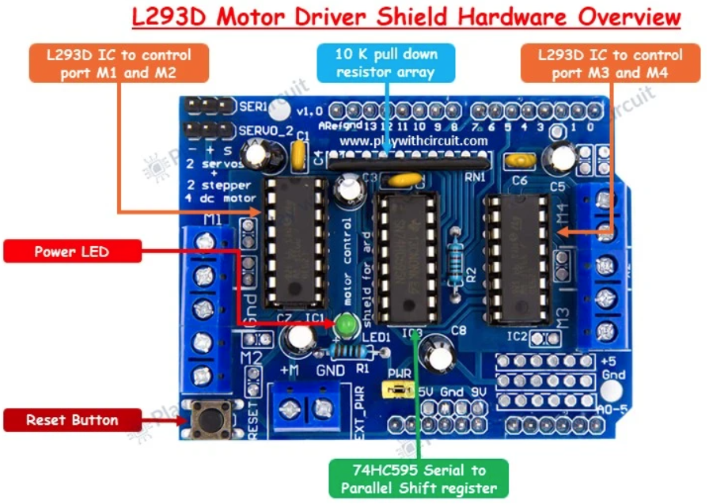
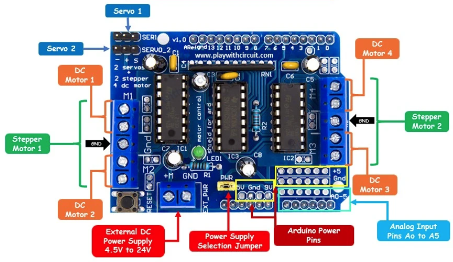

# L293D Motor Driver Shield

Technical hardware documentation and register mapping for the **L293D Motor Driver Shield** (compatible with Arduino Uno R3 / Mega 2560, based on the Adafruit Motor Shield v1 architecture) used on the **tracked_bot** platform.

Reference Documentation:
- [Arduino Project Hub - L293D Motor Driver Shield with Arduino](https://projecthub.arduino.cc/jrachana/l293d-motor-driver-shield-with-arduino-fe6bcb)
- [Play With Circuit - L293D Motor Driver Shield Complete Guide](https://playwithcircuit.com/l293d-motor-driver-shield-arduino-tutorial/)

Datasheet References:
- [L293 / L293D Quadruple Half-H Drivers Datasheet](datasheets/l293.pdf)
- [SN74HCS595 8-Bit Shift Register with Output Latches Datasheet](datasheets/sn74hcs595-q1.pdf)

Hardware Images:
- Shield Board: [images/motor_driver_shield.png](images/motor_driver_shield.png)
- Shield Pinout: [images/motor_driver_shield_pinout.png](images/motor_driver_shield_pinout.png)

---

## 📋 Table of Contents

1. [Hardware Overview & Architecture](#-hardware-overview--architecture)
2. [Electrical & Functional Specifications](#-electrical--functional-specifications)
3. [Power Supply Configuration & PWR Jumper](#-power-supply-configuration--pwr-jumper)
4. [Complete Arduino Pin Allocation Matrix](#-complete-arduino-pin-allocation-matrix)
5. [74HC595 Shift Register Mapping & Protocol](#-74hc595-shift-register-mapping--protocol)
6. [Speed Control via Hardware PWM (Timer0)](#-speed-control-via-hardware-pwm-timer0)
7. [Tracked Bot Motor Mapping (M3 & M4)](#-tracked-bot-motor-mapping-m3--m4)
8. [Servo and Stepper Motor Interfaces](#-servo-and-stepper-motor-interfaces)
9. [Hardware Protection, Noise Filtering & Troubleshooting](#-hardware-protection-noise-filtering--troubleshooting)

---

## 🔧 Hardware Overview & Architecture

The L293D Motor Driver Shield stacks directly onto an Arduino Uno R3 form-factor board. It integrates two dual H-bridge motor driver ICs and an 8-bit serial-in/parallel-out shift register to drive multiple motors while minimizing the required microcontroller GPIO count:



1. **IC1 (L293D):** Quadruple high-current half-H driver. Drives **Motor 1** (M1) and **Motor 2** (M2).
2. **IC2 (L293D):** Quadruple high-current half-H driver. Drives **Motor 3** (M3) and **Motor 4** (M4) (dedicated to the left and right tracks on `tracked_bot`).
3. **IC3 (SN74HC595N):** 8-bit serial-in, parallel-out shift register with output latches. Expands 4 microcontroller control lines into 8 direction signals feeding the H-bridges of IC1 and IC2.
4. **Pull-Down Resistor Network:** A 10 kΩ resistor array grounds the L293D logic inputs during microcontroller power-up and reset cycles, preventing motors from running unpredictably.
5. **Reset Button:** Duplicates the Arduino Uno reset switch to the top of the shield for convenient physical access.
6. **Power Indicator LED:** Illuminates when power is supplied to the motor supply rail.

---

## ⚡ Electrical & Functional Specifications

| Parameter | Specification | Notes |
| :--- | :--- | :--- |
| **Motor Supply Voltage ($V_{motor}$)** | **4.5 V to 24 V DC** | Absolute maximum rating up to 36 V per L293D datasheet |
| **Logic Supply Voltage ($V_{logic}$)** | **5.0 V DC** | Supplied directly from Arduino 5 V rail |
| **Continuous Output Current** | **600 mA (0.6 A) per channel** | Depends on ambient temperature and heat dissipation |
| **Peak Output Current** | **1.2 A per channel** | Non-repetitive transient / stall current |
| **DC Motor Capacity** | Up to **4 bidirectional DC motors** | Individual 8-bit speed selection via PWM |
| **Stepper Motor Capacity** | Up to **2 stepper motors** | Unipolar or bipolar (connected to M1–M2 and M3–M4) |
| **Servo Motor Capacity** | Up to **2 hobby RC servos (5 V)** | Dedicated headers with a 100 µF filter capacitor |
| **Over-Temperature Protection** | Internal thermal shutdown | Disables output stages under excessive junction heat |
| **Internal Clamping Diodes** | Built-in flyback suppression diodes | Protects against inductive back-EMF spikes |

---

## 🔋 Power Supply Configuration & PWR Jumper

The shield features a 2-pin screw terminal block labeled **`EXT_PWR`** and an adjacent 2-pin jumper header labeled **`PWR`** (or `PWR_JMP`).

> [!WARNING]
> **Short-Circuit Danger:** Never connect an external power source to the `EXT_PWR` terminals while the `PWR` jumper is installed and the Arduino is connected to a computer USB port or DC power jack. Leaving the jumper installed bridges the external motor supply directly to the Arduino's 5V/VIN rail, which can permanently destroy the Arduino board, the shield, and the host computer's USB port!

### Operating Modes:

| Configuration | `PWR` Jumper State | Motor Supply Source | Arduino Logic Supply | Recommended Use Case |
| :--- | :--- | :--- | :--- | :--- |
| **Mode 1: Single Supply** | **INSTALLED (Closed)** | Powered via Arduino DC barrel jack or `VIN` | Same as motor supply | Prototyping with low-power motors (<9–12 V) where motor noise does not brown out the MCU. |
| **Mode 2: Dual / Separate Supplies** *(Recommended)* | **REMOVED (Open)** | External battery or power supply connected to **`EXT_PWR`** (4.5 V – 24 V) | USB cable or independent battery/power bank | **Standard for `tracked_bot`:** Isolates MCU logic from motor current surges, voltage dips, and inductive brush noise. |

---

## 📌 Complete Arduino Pin Allocation Matrix

The shield occupies digital pins **D3 through D12**. Digital pins **D0, D1, D2, D13** and all analog pins **A0 through A5** remain completely untouched by the shield and are exposed for user hardware:



| Arduino Pin | AVR Pin | Shield Net / Function | Dedicated Usage on Shield | `tracked_bot` Status / Usage |
| :--- | :--- | :--- | :--- | :--- |
| **D0 (RX)** | `PD0` | *Unused by shield* | None | **USART0 RX** – Serial communication with ESP8266 WiFi |
| **D1 (TX)** | `PD1` | *Unused by shield* | None | **USART0 TX** – Serial communication with ESP8266 WiFi |
| **D2** | `PD2` | *Unused by shield* | None | **FREE GPIO** – External Interrupt 0 (`INT0`), sensors, encoders |
| **D3** | `PD3` | `PWM2B` (OC2B) | Motor 2 Speed / Enable (IC1 3,4EN) | Reserved (unused on tracked platform) |
| **D4** | `PD4` | `DIR_CLK` | 74HC595 Shift Clock | **74HC595 Clock Line** |
| **D5** | `PD5` | `PWM0B` (OC0B) | Motor 4 Speed / Enable (IC2 3,4EN) | **Right Track PWM Speed** (Timer0 Fast PWM) |
| **D6** | `PD6` | `PWM0A` (OC0A) | Motor 3 Speed / Enable (IC2 1,2EN) | **Left Track PWM Speed** (Timer0 Fast PWM) |
| **D7** | `PD7` | `DIR_EN` | 74HC595 Output Enable (active LOW) | **74HC595 Output Enable** (`~OE`) |
| **D8** | `PB0` | `DIR_SER` | 74HC595 Serial Data Input | **74HC595 Serial Data** (`SER`) |
| **D9** | `PB1` | `PWM1A` (OC1A) | Servo 2 PWM Control (`SERVO_2`) | Reserved / Free for pan-tilt servo |
| **D10** | `PB2` | `PWM1B` (OC1B) | Servo 1 PWM Control (`SER1`) | Reserved / Free for pan-tilt servo |
| **D11** | `PB3` | `PWM2A` (OC2A) | Motor 1 Speed / Enable (IC1 1,2EN) | Reserved (unused on tracked platform) |
| **D12** | `PB4` | `DIR_LATCH` | 74HC595 Storage Latch Clock | **74HC595 Latch Line** (`RCLK`) |
| **D13** | `PB5` | *Unused by shield* | Arduino Uno onboard LED | **FREE GPIO** / SPI SCK / Built-in LED |
| **A0** | `PC0` | *Analog Breakout* | None | **Battery Voltage Sense** (resistive voltage divider) |
| **A1** | `PC1` | *Analog Breakout* | None | **HC-SR04 Ultrasonic Trigger** / Analog Sensor |
| **A2** | `PC2` | *Analog Breakout* | None | **HC-SR04 Ultrasonic Echo** / Analog Sensor |
| **A3** | `PC3` | *Analog Breakout* | None | **FREE GPIO / Analog Input** |
| **A4 (SDA)** | `PC4` | *Analog Breakout* | None | **I2C SDA** – IMU/Gyro (MPU-6050) or OLED display |
| **A5 (SCL)** | `PC5` | *Analog Breakout* | None | **I2C SCL** – IMU/Gyro (MPU-6050) or OLED display |

---

## 🔄 74HC595 Shift Register Mapping & Protocol

The 74HC595 shift register deserializes an 8-bit word clocked in from the microcontroller into the 8 direction control signals feeding the L293D H-bridges.

### Subsystem Topology:
```
  ATmega328P (4 pins)              74HC595 (8 outputs)              L293D H-Bridges
 +--------------------+            +-------------------+            +---------------+
 | Arduino D4  (PD4)  |--- CLK --->| SH_CP (Shift Clk) |            | M1 Direction  |
 | Arduino D7  (PD7)  |--- EN ---->| OE    (Out Enable)|--- Q0..Q7->| M2 Direction  |
 | Arduino D8  (PB0)  |--- SER --->| DS    (Data In)   |            | M3 Left Track |
 | Arduino D12 (PB4)  |--- LATCH-->| ST_CP (Latch Clk) |            | M4 Right Track|
 +--------------------+            +-------------------+            +---------------+
```

### Output Bit Mapping (Q0 – Q7):

| Shift Register Bit | Constant Identifier | L293D IC & Pin | Target Channel | Function |
| :---: | :--- | :--- | :---: | :--- |
| **Bit 0** | `SHIFT_BIT_MOTOR4_A` | IC2 Pin 10 (`3A`) | **Motor 4** | Direction A (Right Track) |
| **Bit 1** | `SHIFT_BIT_MOTOR2_A` | IC1 Pin 2 (`1A`) | **Motor 2** | Direction A |
| **Bit 2** | `SHIFT_BIT_MOTOR1_A` | IC1 Pin 10 (`3A`) | **Motor 1** | Direction A |
| **Bit 3** | `SHIFT_BIT_MOTOR1_B` | IC1 Pin 15 (`4A`) | **Motor 1** | Direction B |
| **Bit 4** | `SHIFT_BIT_MOTOR2_B` | IC1 Pin 7 (`2A`) | **Motor 2** | Direction B |
| **Bit 5** | `SHIFT_BIT_MOTOR3_A` | IC2 Pin 2 (`1A`) | **Motor 3** | Direction A (Left Track) |
| **Bit 6** | `SHIFT_BIT_MOTOR4_B` | IC2 Pin 15 (`4A`) | **Motor 4** | Direction B (Right Track) |
| **Bit 7** | `SHIFT_BIT_MOTOR3_B` | IC2 Pin 7 (`2A`) | **Motor 3** | Direction B (Left Track) |

### Shift Register Control Protocol:

Transmission of an 8-bit direction byte from ATmega328P follows this sequence:
1. Pull `DIR_LATCH` (`PB4` / D12) **LOW** to prepare the storage register.
2. For each bit (from MSB **Bit 7** down to LSB **Bit 0**):
   - Set `DIR_CLK` (`PD4` / D4) **LOW**.
   - Output the data bit value on `DIR_SER` (`PB0` / D8).
   - Set `DIR_CLK` **HIGH** (data is shifted into the 74HC595 on the rising clock edge).
3. Pull `DIR_LATCH` **HIGH** (latches the internal 8-bit shift buffer onto output pins Q0–Q7).
4. Maintain `DIR_EN` (`PD7` / D7) **LOW** to keep the outputs enabled (active LOW).

```
Serial Shift Timing Diagram:

 DIR_LATCH (PB4) ---\___________________________________________/--- (ST_CP)
                     Bit 7       Bit 6               Bit 0
 DIR_CLK   (PD4) ___/---\___/---\___/---\___ ... _____/---\________ (SH_CP)
 DIR_SER   (PB0) ===< D7  >===< D6  >=================< D0  >====== (DS)
 Outputs (Q0..Q7):  [Previous Latch State Held]        [New State Output]
```

See implementation in [`shift_reg.c`](../sw/trackedbot/drivers/shift_reg/shift_reg.c) and [`shift_reg.h`](../sw/trackedbot/drivers/shift_reg/shift_reg.h).

---

## ⏱️ Speed Control via Hardware PWM (Timer0)

Speed regulation is performed by driving the L293D enable inputs (`1,2EN` and `3,4EN`) with hardware Pulse Width Modulation (PWM):

```
       ATmega328P                         L293D (IC2)
     +-------------+                    +---------------+
     | PD6 (OC0A)  |---[PWM Speed M3]-->| 1,2EN  (Pin 1)|
     | 74HC595 Q5  |---[Dir A (M3_A)]-->| 1A     (Pin 2)|---> M3 Output (Left Track)
     | 74HC595 Q7  |---[Dir B (M3_B)]-->| 2A     (Pin 7)|---> M3 Output
     |             |                    |               |
     | PD5 (OC0B)  |---[PWM Speed M4]-->| 3,4EN  (Pin 9)|
     | 74HC595 Q0  |---[Dir A (M4_A)]-->| 3A    (Pin 10)|---> M4 Output (Right Track)
     | 74HC595 Q6  |---[Dir B (M4_B)]-->| 4A    (Pin 15)|---> M4 Output
     +-------------+                    +---------------+
```

```
Fast PWM Waveform Timing Diagram:

TCNT0 (Counter)
    ^
255 + - - - - - - - - - - - - - - - - - - - - - - - - - - - - - - - - - TOP
    |            /|            /|            /|            /|
OCR | - - - - - / | - - - - - / | - - - - - / | - - - - - / | - - - - - OCR0A/B
    |          /  |          /  |          /  |          /  |
  0 +---------+---+---------+---+---------+---+---------+---+---------> Time
OC0x Pin (PD6 / PD5)
  1 |=========|   |=========|   |=========|   |=========|   |
  0 +---------+---+---------+---+---------+---+---------+---+--------->
    |<--Duty->|   |<--Duty->|   |<--Duty->|   |<--Duty->|   |
    |<------ Period ~1.024ms (976 Hz) ------->|
```

### Fast PWM Configuration on ATmega328P:
- **Timer:** `Timer0` (8-bit counter, TOP = 0xFF / 255).
- **PWM Mode:** Fast PWM Mode 3 (`WGM01 = 1`, `WGM00 = 1`).
- **Output Channels:** Non-inverting PWM on `OC0A` (`PD6`, pin D6) and `OC0B` (`PD5`, pin D5).
- **Clock Prescaler:** $N = 64$ (`CS01 = 1`, `CS00 = 1`):
  $$f_{PWM} = \frac{f_{CPU}}{N \times 256} = \frac{16\,000\,000\,\text{Hz}}{64 \times 256} \approx 976.56\,\text{Hz}$$
- **Duty Cycle Registers:**
  - `OCR0A`: Duty cycle for **Motor 3** (Left Track), range `0` (0% OFF) to `255` (100% full speed).
  - `OCR0B`: Duty cycle for **Motor 4** (Right Track), range `0` (0% OFF) to `255` (100% full speed).

A frequency of ~976 Hz balances low acoustic motor whine with minimal switching losses in the bipolar L293D output transistors.

---

## 🏎️ Tracked Bot Motor Mapping (M3 & M4)

The tracked platform utilizes **Motor 3** for the left track drive and **Motor 4** for the right track drive:

### H-Bridge Control Truth Table:

| Channel | Desired Motion | PWM Duty (`OCR0x`) | Dir A (`74HC595`) | Dir B (`74HC595`) | Output Terminals | Resulting State |
| :--- | :--- | :---: | :---: | :---: | :---: | :--- |
| **M3 (Left Track)** | **Forward** | `1 .. 255` | `MOTOR3_A (bit 5) = 1` | `MOTOR3_B (bit 7) = 0` | Out 1 = HIGH, Out 2 = LOW | Track drives forward |
| | **Reverse** | `1 .. 255` | `MOTOR3_A (bit 5) = 0` | `MOTOR3_B (bit 7) = 1` | Out 1 = LOW, Out 2 = HIGH | Track drives reverse |
| | **Dynamic Brake** | `1 .. 255` | `MOTOR3_A (bit 5) = 0` | `MOTOR3_B (bit 7) = 0` | Out 1 = LOW, Out 2 = LOW | Active dynamic braking |
| | **Coast / Off** | `0` | Don't care (`X`) | Don't care (`X`) | High-Z floating | Track coasts freely |
| **M4 (Right Track)** | **Forward** | `1 .. 255` | `MOTOR4_A (bit 0) = 1` | `MOTOR4_B (bit 6) = 0` | Out 3 = HIGH, Out 4 = LOW | Track drives forward |
| | **Reverse** | `1 .. 255` | `MOTOR4_A (bit 0) = 0` | `MOTOR4_B (bit 6) = 1` | Out 3 = LOW, Out 4 = HIGH | Track drives reverse |
| | **Dynamic Brake** | `1 .. 255` | `MOTOR4_A (bit 0) = 0` | `MOTOR4_B (bit 6) = 0` | Out 3 = LOW, Out 4 = LOW | Active dynamic braking |
| | **Coast / Off** | `0` | Don't care (`X`) | Don't care (`X`) | High-Z floating | Track coasts freely |

Firmware driver references:
- [`l293d_shield.h`](../sw/trackedbot/drivers/l293d_shield/l293d_shield.h)
- [`l293d_shield.c`](../sw/trackedbot/drivers/l293d_shield/l293d_shield.c)

---

## 🤖 Servo and Stepper Motor Interfaces

While `tracked_bot` primarily uses DC gearmotors on M3 and M4, the shield natively supports other actuator types:

### 1. Hobby RC Servo Motors (SER1 & SERVO_2):
- **Headers:** Two 3-pin headers with standard `[GND, +5V, Signal]` pinout.
- **Pin Assignment:**
  - `SER1` (Servo 1): Arduino pin **D10** (`PB2` / Timer1 OC1B).
  - `SERVO_2` (Servo 2): Arduino pin **D9** (`PB1` / Timer1 OC1A).
- **Powering Servos:** Servo power is sourced from the Arduino 5 V line. The shield features an onboard 100 µF electrolytic decoupling capacitor across the servo power rail to absorb transient current spikes.

### 2. Stepper Motors:
- Up to two stepper motors (unipolar or bipolar, e.g., 28BYJ-48 with 5V or NEMA 17 with external supply):
  - **Stepper 1:** Connected across motor terminals **M1** (Coil 1) and **M2** (Coil 2).
  - **Stepper 2:** Connected across motor terminals **M3** (Coil 1) and **M4** (Coil 2).
- Stepping sequence is controlled by cycling the four corresponding H-bridge direction bits in the 74HC595 register (full-step, half-step, or wave drive).

---

## 🛡️ Hardware Protection, Noise Filtering & Troubleshooting

### 1. Inrush Current & Motor Stall:
- Tracked chassis encounter high mechanical resistance during in-place pivot turns, leading to current spikes approaching the motor stall current.
- Ensure the motor power supply can deliver at least 2 A peak current.
- If the microcontroller resets when motors start (brownout reset), remove the `PWR` jumper and power the Arduino logic separately via a 5 V USB power bank.

### 2. EMI Suppression (Brush Noise):
- DC motors generate high-frequency electromagnetic interference (EMI) due to mechanical brush commutation.
- **Best practice:** Solder a **100 nF (0.1 µF)** ceramic capacitor directly across the two terminals of each DC motor. Optionally, solder two additional 100 nF capacitors from each motor terminal to the motor's metal chassis casing.

### 3. Thermal Considerations:
- The L293D package is rated for 600 mA continuous current per channel. If motors draw close to this limit under continuous load, stick-on aluminum heatsinks can be attached to the tops of IC1 and IC2 to prevent thermal shutdown tripping.

### 4. Common Troubleshooting Checklist:

| Symptom | Probable Cause | Corrective Action |
| :--- | :--- | :--- |
| **Motors do not rotate** | Power jumper missing or no voltage on `EXT_PWR` | Check LED indicator. Verify external battery voltage and connection polarity on `EXT_PWR`. |
| **MCU reboots on motor startup** | Voltage sag / brownout on shared power rail | Remove `PWR` jumper and power Arduino via dedicated USB supply. |
| **One track rotates backwards** | Inverted motor polarity or shift register bit order | Swap the motor wires on the M3/M4 screw terminal, or invert direction flags in [`l293d_shield.c`](../sw/trackedbot/drivers/l293d_shield/l293d_shield.c). |
| **Motor hums but cannot move** | PWM duty cycle is below the motor deadband | Increase `OCR0x` starting threshold (typically duty cycle > 25–30% is needed to overcome gearbox friction). |
| **Servo twitches / jitters** | Insufficient 5 V current or supply ripple | Use an external 5 V BEC/regulator for servos or avoid powering heavy servos from the Arduino 5 V pin. |
