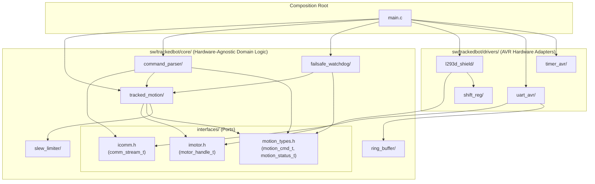
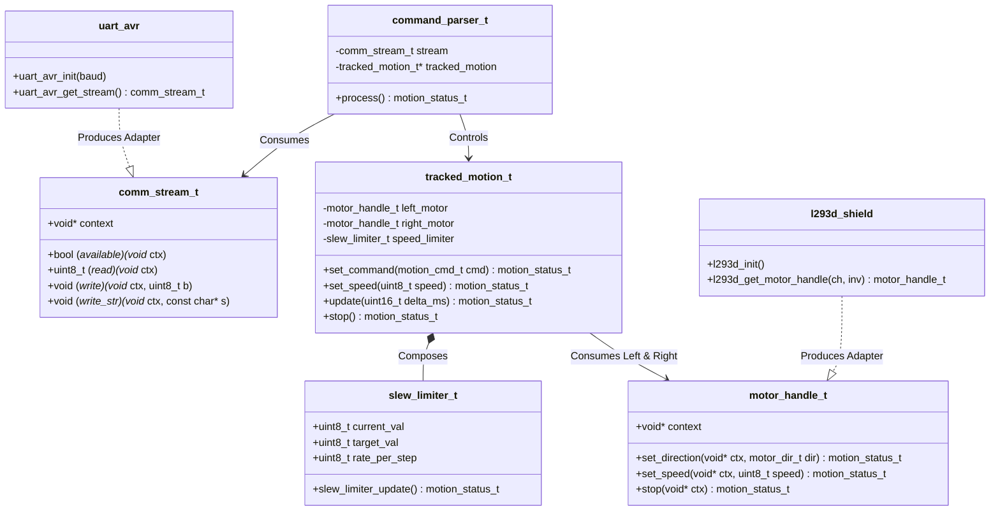
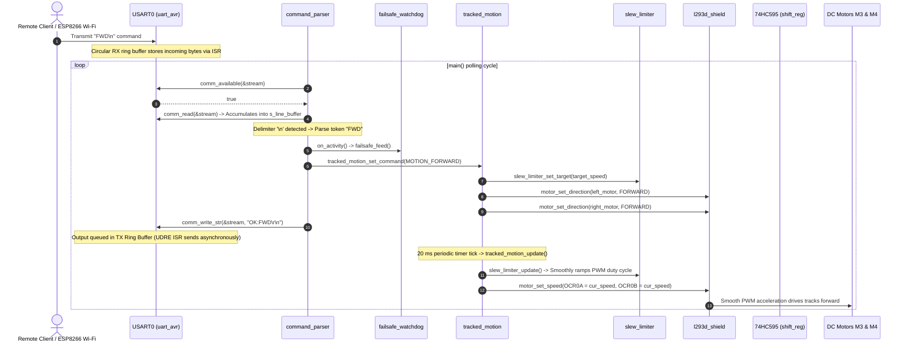

# Software Architecture & SOLID Design - tracked_bot

This document specifies the **Hexagonal Software Architecture (Ports & Adapters)** of the **tracked_bot** firmware for the **ATmega328P** microcontroller (16 MHz), the directory layout, the contract header specifications (`core/interfaces/`), and the implementation of **SOLID** design principles in Embedded C.

---

## 📋 Table of Contents

1. [Architectural Principles (SOLID & Hexagonal)](#-architectural-principles-solid--hexagonal)
2. [Software Directory Structure](#-software-directory-structure)
3. [Contracts & Ports (`core/interfaces/`)](#-contracts--ports-coreinterfaces)
4. [Encapsulation & Localization of Hardware Constants](#-encapsulation--localization-of-hardware-constants)
5. [Tracked Locomotion Kinematics (`tracked_motion`) & Soft-Start Slew Limiting](#-tracked-locomotion-kinematics-tracked_motion--soft-start-slew-limiting)
6. [Communication Protocol & Non-Blocking Circular Buffers](#-communication-protocol--non-blocking-circular-buffers)
7. [Dependency & Architecture Graphs](#-dependency--architecture-graphs)
   - [Static Module Dependency Graph](#static-module-dependency-graph)
   - [Contracts & Dependency Injection Class Diagram](#contracts--dependency-injection-class-diagram)
   - [Command Processing Sequence Diagram](#command-processing-sequence-diagram)
8. [Cross-Reference & Related Documentation](#-cross-reference--related-documentation)

---

## 🏛️ Architectural Principles (SOLID & Hexagonal)

The firmware is structured according to **Ports & Adapters (Hexagonal Architecture)** and **SOLID** principles tailored for resource-constrained 8-bit AVR microcontrollers:

1. **Interface Ownership & Inversion of Control (DIP - Dependency Inversion Principle):**
   - Following the rule *"Clients own the interfaces"*, all contract definitions reside in **`core/interfaces/`**.
   - Core domain logic in `core/` defines what it requires to operate (`imotor.h` for motor drive control, `icomm.h` for stream communication, `motion_types.h` for status and kinematic states).
   - Higher-level domain modules never depend on low-level drivers; both depend on abstract interface contracts.

2. **Hardware-Agnostic Core Domain (SRP - Single Responsibility Principle):**
   - Files within `core/` have **zero dependencies** on AVR-specific hardware headers (`<avr/io.h>`, `<avr/interrupt.h>`) or MCU registers.
   - The domain algorithms (kinematics, slew limiter, line parser, circular buffer) are pure C99 and can be compiled and unit-tested directly on a host PC without hardware emulators.

3. **Interchangeable Hardware Adapters (`drivers/` - OCP - Open/Closed Principle):**
   - Concrete implementations of microcontroller peripherals (Timer0 Fast PWM, 74HC595 shift register, USART0 with interrupt-driven ring buffers, Timer1 CTC millisecond timebase) implement the contracts defined in `core/interfaces/`.
   - Changing motor driver hardware (e.g., from L293D to TB6612FNG or DRV8833) requires writing a new adapter in `drivers/` without touching a single line of domain code in `core/`.

4. **Composition Root (`main.c`):**
   - The `main.c` file serves as the single **Composition Root** of the application.
   - It instantiates concrete driver adapters, injects them into the core domain structures via **Dependency Injection (DI)**, and arms the hardware Watchdog Timer (`wdt_enable(WDTO_2S)`).

5. **Defensive Programming & MISRA C Status Codes:**
   - Functions return structured error codes `motion_status_t` (`MOTION_STATUS_OK`, `MOTION_STATUS_INVALID_ARG`, `MOTION_STATUS_ERROR`) instead of unchecked `void` returns.
   - All public APIs enforce strict `NULL` pointer validation and early returns to maintain execution predictability.

---

## 📁 Software Directory Structure

Each functional component is isolated into a dedicated sub-directory containing its corresponding `.c` and `.h` pair:

```text
sw/trackedbot/
├── main.c                             ◄── Composition Root (Dependency Injection, WDT reset)
│
├── core/                              ◄── DOMAIN LOGIC (100% hardware-independent C99)
│   ├── interfaces/                    ◄── Port Contracts & Domain Types
│   │   ├── icomm.h                         - Communication stream port (comm_stream_t)
│   │   ├── imotor.h                        - Motor actuator port (motor_handle_t, motor_dir_t)
│   │   └── motion_types.h                  - Motion commands, kinematic states & status codes
│   │
│   ├── tracked_motion/                ◄── Differential tracked chassis kinematics
│   │   ├── tracked_motion.h                - tracked_motion_t, speed limits, API
│   │   └── tracked_motion.c                - Skid-steering kinematics, composition with slew_limiter
│   │
│   ├── slew_limiter/                  ◄── Soft-start / Slew-rate acceleration ramp
│   │   ├── slew_limiter.h                  - slew_limiter_t, API
│   │   └── slew_limiter.c                  - Pure mathematical acceleration/deceleration ramp
│   │
│   ├── command_parser/                ◄── Line-based robust ASCII command parser
│   │   ├── command_parser.h                - command_parser_t, callback handlers, API
│   │   └── command_parser.c                - Line accumulation, noise filtering, responses
│   │
│   ├── failsafe_watchdog/             ◄── Software auto-stop safety timer
│   │   ├── failsafe_watchdog.h             - failsafe_watchdog_t, configuration, API
│   │   └── failsafe_watchdog.c             - Automatic motor shutdown on communication loss
│   │
│   └── ring_buffer/                   ◄── Generic FIFO Circular Buffer (SPSC lock-free)
│       ├── ring_buffer.h                   - ring_buffer_t, API
│       └── ring_buffer.c                   - Single-Producer Single-Consumer circular queue
│
├── drivers/                           ◄── HARDWARE ADAPTERS (AVR registers & shield pins)
│   ├── l293d_shield/                  ◄── L293D motor shield adapter
│   │   ├── l293d_shield.h                  - l293d_channel_t enum, API, imotor adapter
│   │   └── l293d_shield.c                  - Timer0 PWM registers (OCR0A/OCR0B), H-bridge logic
│   │
│   ├── uart_avr/                      ◄── USART0 stream adapter (Non-blocking RX & TX)
│   │   ├── uart_avr.h                      - uart_config_t, API, icomm adapter
│   │   └── uart_avr.c                      - USART_RX_vect & USART_UDRE_vect ring buffer ISRs
│   │
│   ├── shift_reg/                     ◄── 74HC595 8-bit shift register driver
│   │   ├── shift_reg.h                     - Serial bit-bang transmission API
│   │   └── shift_reg.c                     - Uno pin mappings (PD4, PD7, PB0, PB4)
│   │
│   └── timer_avr/                     ◄── Timer1 1 ms millisecond system timebase
│       ├── timer_avr.h                     - Millis timebase API and periodic tick utilities
│       └── timer_avr.c                     - Timer1 CTC configuration (16 MHz / 64 prescaler)
│
└── build/                             ◄── BUILD SYSTEM & MAKEFILES
    ├── cflags.mk                           - Unified compiler flags and modular include paths
    ├── subdir.mk                           - Per-subfolder compilation rules
    ├── tools.mk                            - Toolchain definitions (avr-gcc, avr-objcopy, avrdude)
    └── Makefile                            - Master build target orchestration
```

---

## 📜 Contracts & Ports (`core/interfaces/`)

The contracts define abstract struct-of-function-pointers that decouple domain interactors from physical hardware peripherals:

### 1. `icomm.h` – Byte Stream Port
Abstracts any bidirectional byte-oriented communication medium (UART, USB-CDC, SPI, virtual ring buffer):

```c
typedef struct {
  void *context;
  bool (*available)(void *context);
  uint8_t (*read)(void *context);
  void (*write)(void *context, uint8_t byte);
  void (*write_str)(void *context, const char *str);
} comm_stream_t;
```

### 2. `imotor.h` – Actuator Actuation Port
Abstracts a single directional motor channel regardless of the underlying H-bridge IC or PWM generation scheme:

```c
typedef struct {
  void *context;
  motion_status_t (*set_direction)(void *context, motor_dir_t dir);
  motion_status_t (*set_speed)(void *context, uint8_t speed);
  motion_status_t (*stop)(void *context);
} motor_handle_t;
```

### 3. `motion_types.h` – Domain Types & Status Codes
Provides standard enumeration types for locomotion directions, kinematic states, and return statuses:

```c
typedef enum {
  MOTION_STATUS_OK = 0,
  MOTION_STATUS_ERROR,
  MOTION_STATUS_INVALID_ARG
} motion_status_t;

typedef enum {
  MOTION_STOP = 0,
  MOTION_FORWARD,
  MOTION_BACKWARD,
  MOTION_TURN_LEFT,
  MOTION_TURN_RIGHT,
  MOTION_SPIN_LEFT,
  MOTION_SPIN_RIGHT
} motion_cmd_t;
```

---

## 🔒 Encapsulation & Localization of Hardware Constants

To satisfy the **Open/Closed Principle (OCP)** and eliminate brittle global macros, hardware-specific constants are strictly confined to their respective adapter modules:

* **L293D Shield Pin Mappings:** Port registers (`DDRD`, `PORTD`, `DDRB`, `PORTB`) and Timer0 fast PWM configuration (`TCCR0A`, `TCCR0B`, `OCR0A`, `OCR0B`) are defined solely inside `drivers/l293d_shield/l293d_shield.c`. For electrical pinout details, see [../hw/motor_shield.md](../hw/motor_shield.md).
* **74HC595 Direction Latch:** Serial clock (`PD4`), latch (`PB4`), serial data (`PB0`), and output enable (`PD7`) are isolated inside `drivers/shift_reg/shift_reg.c`.
* **USART0 Hardware Registers:** Baud rate registers (`UBRR0H`, `UBRR0L`), control registers (`UCSR0A`, `UCSR0B`, `UCSR0C`), and interrupt vectors (`USART_RX_vect`, `USART_UDRE_vect`) are encapsulated within `drivers/uart_avr/uart_avr.c`. For Wi-Fi ESP8266 routing via DIP switches, see [../hw/main_board.md](../hw/main_board.md).

---

## 🚜 Tracked Locomotion Kinematics (`tracked_motion`) & Soft-Start Slew Limiting

### Differential Skid-Steering Kinematics
The **`tracked_motion`** module manages differential track velocities for the [T101 mechanical chassis](../body/README.md):
- **`MOTION_FORWARD` / `MOTION_BACKWARD`**: Both tracks operate synchronously at equal target speeds.
- **`MOTION_TURN_LEFT` / `MOTION_TURN_RIGHT`**: Pivot turn where one track is halted and the opposing track drives forward.
- **`MOTION_SPIN_LEFT` / `MOTION_SPIN_RIGHT`**: In-place counter-rotation ($R = 0$) where opposing tracks rotate in opposite directions.

### Slew Rate Acceleration Limiting (`slew_limiter`)
Directly switching motor PWM from 0 to 255 produces massive inrush currents (up to 2.5 A per motor at stall), causing battery voltage sag that can brown out the ATmega328P and overheat the L293D drivers (see [../hw/power_supply.md](../hw/power_supply.md)):
- **Periodic Stepping:** The `slew_limiter` ramps current motor speed toward the target speed in fixed increment steps executed every 20 ms.
- **Immediate Emergency Stop:** When a `MOTION_STOP` command or a failsafe timeout occurs, the slew limiter is bypassed to guarantee an immediate zero-latency stop.

---

## 📡 Communication Protocol & Non-Blocking Circular Buffers

### Protocol Support
The firmware supports two protocol layers:
1. **Binary Interface Control Document (ICD):** High-performance, CRC-8 validated compact binary protocol defined in [protocol.md](protocol.md).
2. **ASCII Line-Based Protocol:** Human-readable text protocol for interactive terminal debugging over UART / Wi-Fi:
   - Inbound commands: `FWD\n`, `BWD\n`, `LEFT\n`, `RIGHT\n`, `SPINL\n`, `SPINR\n`, `STOP\n`, `SPD:<val>\n`, `PING\n`.
   - Outbound acknowledgments: `OK:FWD\r\n`, `OK:SPD\r\n`, `PONG\r\n`, `ERR:UNKNOWN\r\n`.

### Asynchronous Interrupt-Driven Circular Buffers
* **Reception (`USART_RX_vect`):** Incoming bytes are pushed into a lock-free Single-Producer Single-Consumer (SPSC) circular queue (`ring_buffer_t`). The main loop pulls characters without blocking.
* **Transmission (`USART_UDRE_vect`):** Transmitted strings are written to `s_tx_ring`. The Data Register Empty interrupt triggers in the background, feeding the hardware `UDR0` register until the buffer is empty, ensuring zero CPU stalls during telemetry transmission.

---

## 📊 Dependency & Architecture Graphs

### Static Module Dependency Graph



---

### Contracts & Dependency Injection Class Diagram



---

### Command Processing Sequence Diagram



---

## 🔗 Cross-Reference & Related Documentation

* **[Binary Protocol Specification (protocol.md)](protocol.md)**: Frame anatomy, CRC-8 polynomial, message IDs, telemetry structs, and receiver state machine.
* **[Hardware Overview (../hw/README.md)](../hw/README.md)**: Master unified pinout matrix, dual-supply architecture, and hardware sitemap.
* **[Motor Driver Shield (../hw/motor_shield.md)](../hw/motor_shield.md)**: Timer0 PWM registers (`OCR0A`/`OCR0B`), 74HC595 direction multiplexer, and M3/M4 differential channel mapping.
* **[Main Controller Board (../hw/main_board.md)](../hw/main_board.md)**: Uno+WiFi R3 (ATmega328P + ESP8266), 8-position DIP switch configurations, and flashing procedures.
* **[Power Supply & Rails (../hw/power_supply.md)](../hw/power_supply.md)**: Dual-rail isolation (`EXT_PWR` vs. USB), motor EMI filtering, and battery current budgets.
* **[Mechanical Chassis & Assembly (../body/README.md)](../body/README.md)**: T101 platform specifications, skid-steering kinematics, and physical assembly guide.
