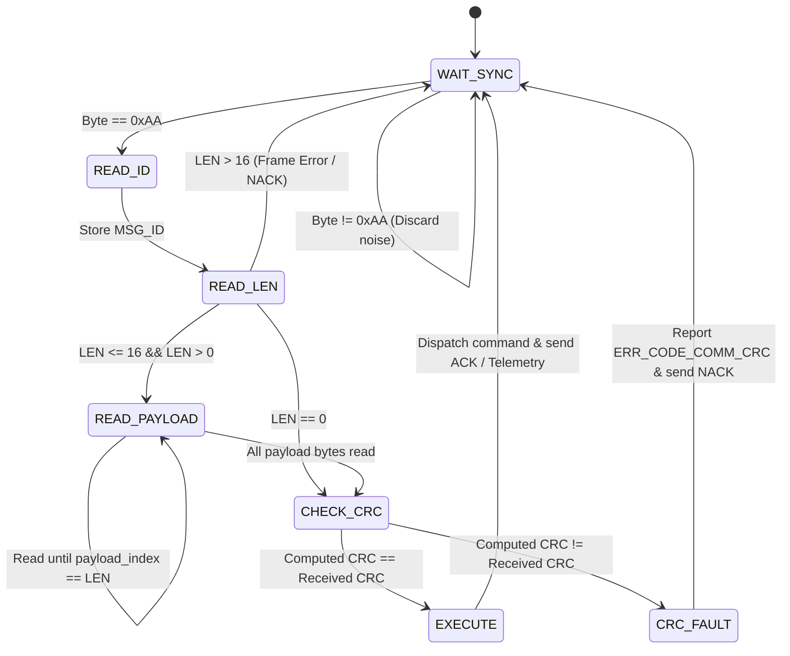

# Tracked Robot Binary Protocol Specification (ICD)

## 1. Overview & Architecture

This document defines the **Interface Control Document (ICD)** for the binary communication protocol used by the **Tracked Robot** (`tracked_bot`). 

The protocol connects high-level telemetry/control clients (e.g. Python CLI, Web GUI, autonomous navigators) to the onboard ATmega328P microcontroller running at 16 MHz via UART (115200 baud, 8-N-1) or transparent ESP8266 WiFi bridges.

### 1.1 Key Design Principles
* **Deterministic & Compact:** Replaces ASCII text commands with compact fixed-header binary frames. A telemetry status frame is reduced from 65 bytes to 11 bytes (an **83% bandwidth reduction**).
* **Integrity via CRC-8:** Every packet is protected by a hardware-friendly CRC-8 checksum ($x^8 + x^2 + x + 1$, polynomial `0x07`).
* **Zero Dynamic Allocation:** Fixed max payload sizes (maximum 16 bytes payload) guarantee $O(1)$ constant time parsing without dynamic memory allocation or heap fragmentation.
* **$O(1)$ Dispatch:** Binary message IDs allow direct switch-case branch execution in the microcontroller firmware, avoiding string comparisons in loops.
* **Bi-Directional Handshaking:** Commands return affirmative acknowledgments (`RESP_ACK`), structured error feedback (`RESP_NACK`), or dedicated response frames (`RESP_STATUS`, `RESP_DIAG`, `RESP_PONG`).

---

## 2. Frame Anatomy

Every packet transmitted across the communication medium follows a uniform 4-part structure:

```text
+--------+--------+--------+--------------------------+--------+
|  SYNC  | MSG_ID |  LEN   |         PAYLOAD          |  CRC8  |
| 1 Byte | 1 Byte | 1 Byte |        0..16 Bytes       | 1 Byte |
+--------+--------+--------+--------------------------+--------+
```

| Field | Length | Value / Range | Description |
| :--- | :--- | :--- | :--- |
| **SYNC** | 1 Byte | `0xAA` (170 dec) | Frame synchronization delimiter indicating start of a new packet. |
| **MSG_ID** | 1 Byte | `0x01` .. `0xFF` | Unique Message Identifier defining command or telemetry type. |
| **LEN** | 1 Byte | `0x00` .. `0x10` | Payload length in bytes ($0 \le N \le 16$). |
| **PAYLOAD** | $N$ Bytes | Variable | Command parameters or telemetry payload ($N$ bytes). Empty if `LEN` = 0. |
| **CRC8** | 1 Byte | `0x00` .. `0xFF` | CRC-8 checksum computed over `[MSG_ID, LEN, PAYLOAD...]`. |

> [!NOTE]
> The `SYNC` byte (`0xAA`) is **excluded** from the CRC-8 computation to allow stream-oriented synchronization recovery without recursive checksum dependency.

---

## 3. CRC-8 Algorithm Specification

The CRC-8 checksum is calculated using the ATM / SMBus polynomial standard:

* **Polynomial:** $x^8 + x^2 + x^1 + x^0 = \mathbf{0x07}$
* **Initial Value:** $\mathbf{0x00}$
* **Input Reflection:** False (MSB first)
* **Output Reflection:** False
* **Final XOR:** $\mathbf{0x00}$
* **Coverage:** Calculated sequentially over `MSG_ID`, `LEN`, followed by each byte of `PAYLOAD`.

### 3.1 Bitwise C Implementation Reference
```c
uint8_t crc8_calculate(const uint8_t *data, uint8_t length) {
  uint8_t crc = 0x00;
  for (uint8_t i = 0; i < length; ++i) {
    crc ^= data[i];
    for (uint8_t bit = 0; bit < 8; ++bit) {
      if (crc & 0x80) {
        crc = (uint8_t)((crc << 1) ^ 0x07);
      } else {
        crc = (uint8_t)(crc << 1);
      }
    }
  }
  return crc;
}
```

---

## 4. Message Identifier Registry

### 4.1 Inbound Commands (Client $\rightarrow$ Robot)
Inbound commands use the range `0x01` .. `0x7F`.

| MSG_ID | Name | LEN | Payload Format | Description |
| :---: | :--- | :---: | :--- | :--- |
| `0x01` | `CMD_MOTION` | 1 | `[motion_cmd_t: 1B]` | Drive robot tracks (Forward, Reverse, Turn, Spin). |
| `0x02` | `CMD_SET_SPEED` | 1 | `[speed: 1B]` | Set target PWM drive speed ($0 \dots 255$). |
| `0x03` | `CMD_STOP` | 0 | None | Immediate kinematics deceleration / emergency stop. |
| `0x04` | `CMD_PING` | 0 | None | Heartbeat request (expects `RESP_PONG`). |
| `0x10` | `CMD_GET_STATUS` | 0 | None | Query standard operating telemetry status. |
| `0x11` | `CMD_GET_DIAG` | 0 | None | Query extended hardware and failsafe diagnostic data. |
| `0x12` | `CMD_ERR_CLEAR` | 0 | None | Clear error logs and restore normal operating mode. |

### 4.2 Outbound Responses & Telemetry (Robot $\rightarrow$ Client)
Outbound responses use the high-bit range `0x80` .. `0xFF`.

| MSG_ID | Name | LEN | Payload Format | Description |
| :---: | :--- | :---: | :--- | :--- |
| `0x80` | `RESP_ACK` | 1 | `[cmd_id: 1B]` | Acknowledgment of successful command execution. |
| `0x81` | `RESP_NACK` | 2 | `[cmd_id: 1B] [err_code: 1B]` | Negative acknowledgment indicating command rejection or fault. |
| `0x84` | `RESP_PONG` | 0 | None | Heartbeat response confirming communication link alive. |
| `0x90` | `RESP_STATUS` | 7 | 7-byte telemetry struct | Consolidated status (mode, error, counts, kinematics, speed). |
| `0x91` | `RESP_DIAG` | 9 | 9-byte diagnostic struct | Full telemetry + failsafe status + motor lock state. |

---

## 5. Payload Structures & Bitfield Enumerations

### 5.1 Motion Command Enumeration (`motion_cmd_t`)
Used in `CMD_MOTION` (payload byte 0) and reported in `RESP_STATUS` (payload byte 5):

| Value | Identifier | Action |
| :---: | :--- | :--- |
| `0x00` | `MOTION_STOP` | Tracks stopped / idle |
| `0x01` | `MOTION_FORWARD` | Both tracks drive forward |
| `0x02` | `MOTION_BACKWARD` | Both tracks drive reverse |
| `0x03` | `MOTION_TURN_LEFT` | Pivot left (right track forward, left idle) |
| `0x04` | `MOTION_TURN_RIGHT` | Pivot right (left track forward, right idle) |
| `0x05` | `MOTION_SPIN_LEFT` | Counter-rotate left (left reverse, right forward) |
| `0x06` | `MOTION_SPIN_RIGHT` | Counter-rotate right (left forward, right reverse) |

### 5.2 Motion Kinematic State (`motion_state_t`)
Reported in `RESP_STATUS` (payload byte 4):

| Value | Identifier | Meaning |
| :---: | :--- | :--- |
| `0x00` | `MOTION_STATE_IDLE` | Kinematics at rest (speed = 0) |
| `0x01` | `MOTION_STATE_MOVING` | Motors active or slewing towards target |
| `0x02` | `MOTION_STATE_FAILSAFE` | Emergency deceleration triggered |

### 5.3 System Operational Mode (`system_mode_t`)
Reported in `RESP_STATUS` (payload byte 0):

| Value | Identifier | Operating Condition |
| :---: | :--- | :--- |
| `0x00` | `SYSTEM_MODE_NORMAL` | Nominal operations, motor drive enabled |
| `0x01` | `SYSTEM_MODE_DEGRADED` | Subsystem error occurred; motor drive locked |
| `0x02` | `SYSTEM_MODE_PANIC` | Critical hardware fault; safety shutdown |

### 5.4 System Error Diagnostic Codes (`error_code_t`)
Reported in `RESP_NACK` (payload byte 1) and `RESP_STATUS` (payload byte 1):

| Value | Identifier | Root Cause |
| :---: | :--- | :--- |
| `0x00` | `ERR_CODE_NONE` | No error active |
| `0x01` | `ERR_CODE_INIT_UART` | UART driver failed initialization |
| `0x02` | `ERR_CODE_INIT_MOTORS` | L293D shield driver failed initialization |
| `0x03` | `ERR_CODE_INIT_TIMER` | Millisecond timer failed initialization |
| `0x04` | `ERR_CODE_INIT_PARSER` | Parser / dispatcher failed initialization |
| `0x05` | `ERR_CODE_INIT_FAILSAFE` | Failsafe watchdog failed initialization |
| `0x06` | `ERR_CODE_COMM_RX_OVERFLOW` | Serial receive ring buffer overrun |
| `0x07` | `ERR_CODE_COMM_TX_OVERFLOW` | Serial transmit buffer overrun |
| `0x08` | `ERR_CODE_CMD_SYNTAX_ERROR` | Malformed length or invalid parameter value |
| `0x09` | `ERR_CODE_CMD_UNKNOWN` | Unknown / unhandled `MSG_ID` |
| `0x0A` | `ERR_CODE_FAILSAFE_TRIGGERED` | Watchdog timeout expired (loss of communication) |
| `0x0B` | `ERR_CODE_HARDWARE_FAULT` | Critical driver or peripheral malfunction |
| `0x0C` | `ERR_CODE_COMM_CRC` | Checksum mismatch on received frame |

### 5.5 `RESP_STATUS` Payload Layout (7 Bytes)
```text
Byte 0: system_mode_t (0=NORMAL, 1=DEGRADED, 2=PANIC)
Byte 1: error_code_t  (Last active error code)
Byte 2: error_count   (MSB - High byte of 16-bit cumulative error count)
Byte 3: error_count   (LSB - Low byte of 16-bit cumulative error count)
Byte 4: motion_state  (0=IDLE, 1=MOVING, 2=FAILSAFE)
Byte 5: motion_cmd    (0..6 active motion direction)
Byte 6: current_speed (0..255 active slew PWM speed)
```

### 5.6 `RESP_DIAG` Payload Layout (9 Bytes)
```text
Bytes 0..6: Standard RESP_STATUS payload (same as above)
Byte 7:     failsafe_flags (Bitfield):
            - Bit 0 (0x01): Failsafe watchdog enabled
            - Bit 1 (0x02): Failsafe watchdog currently triggered
Byte 8:     motion_lock (0x00 = Motion Allowed, 0x01 = Motion Locked)
```

---

## 6. Detailed Request & Response Hex Examples

Below are concrete, byte-by-byte verified transmission packets for all supported operations.

### 6.1 Heartbeat Ping / Pong

#### Request: `CMD_PING`
* Payload: None (`LEN = 0`)
* CRC-8 Data: `[0x04, 0x00]` $\rightarrow$ `0x54`

```text
TX: 0xAA 0x04 0x00 0x54
```

#### Response: `RESP_PONG`
* Payload: None (`LEN = 0`)
* CRC-8 Data: `[0x84, 0x00]` $\rightarrow$ `0xE2`

```text
RX: 0xAA 0x84 0x00 0xE2
```

---

### 6.2 Motion Commands

#### Request: `CMD_MOTION FWD` (Forward)
* Direction: `MOTION_FORWARD` (`0x01`)
* CRC-8 Data: `[0x01, 0x01, 0x01]` $\rightarrow$ `0x79`

```text
TX: 0xAA 0x01 0x01 0x01 0x79
```

#### Response: `RESP_ACK` (for `0x01`)
* Payload: `[0x01]`
* CRC-8 Data: `[0x80, 0x01, 0x01]` $\rightarrow$ `0x19`

```text
RX: 0xAA 0x80 0x01 0x01 0x19
```

#### Other Direction Requests:
| Command | Action | Payload | Complete Packet (HEX) | CRC-8 |
| :--- | :--- | :---: | :--- | :---: |
| `CMD_MOTION BWD` | Drive Reverse | `0x02` | `0xAA 0x01 0x01 0x02 0x70` | `0x70` |
| `CMD_MOTION LEFT` | Pivot Left | `0x03` | `0xAA 0x01 0x01 0x03 0x77` | `0x77` |
| `CMD_MOTION RIGHT` | Pivot Right | `0x04` | `0xAA 0x01 0x01 0x04 0x62` | `0x62` |
| `CMD_MOTION SPINL` | Counter-Rotate Left | `0x05` | `0xAA 0x01 0x01 0x05 0x65` | `0x65` |
| `CMD_MOTION SPINR` | Counter-Rotate Right | `0x06` | `0xAA 0x01 0x01 0x06 0x6C` | `0x6C` |
| `CMD_STOP` | Decelerate to Stop | None | `0xAA 0x03 0x00 0x3F` | `0x3F` |

---

### 6.3 Speed Control

#### Request: `CMD_SET_SPEED 150` (0x96)
* Speed: `150` (`0x96`)
* CRC-8 Data: `[0x02, 0x01, 0x96]` $\rightarrow$ `0x28`

```text
TX: 0xAA 0x02 0x01 0x96 0x28
```

#### Response: `RESP_ACK` (for `0x02`)
* CRC-8 Data: `[0x80, 0x01, 0x02]` $\rightarrow$ `0x10`

```text
RX: 0xAA 0x80 0x01 0x02 0x10
```

#### Request: `CMD_SET_SPEED 255` (0xFF - Max Speed)
* Speed: `255` (`0xFF`)
* CRC-8 Data: `[0x02, 0x01, 0xFF]` $\rightarrow$ `0x30`

```text
TX: 0xAA 0x02 0x01 0xFF 0x30
```

---

### 6.4 Telemetry Status & Diagnostics

#### Request: `CMD_GET_STATUS`
* Payload: None (`LEN = 0`)
* CRC-8 Data: `[0x10, 0x00]` $\rightarrow$ `0x57`

```text
TX: 0xAA 0x10 0x00 0x57
```

#### Response: `RESP_STATUS` (Example: Normal Mode, Idle, No Errors, Speed 150)
* Payload: `[0x00, 0x00, 0x00, 0x00, 0x00, 0x00, 0x96]`
* CRC-8 Data: `[0x90, 0x07, 0x00, 0x00, 0x00, 0x00, 0x00, 0x00, 0x96]` $\rightarrow$ `0x23`

```text
RX: 0xAA 0x90 0x07 0x00 0x00 0x00 0x00 0x00 0x00 0x96 0x23
```

#### Response: `RESP_STATUS` (Example: Normal Mode, Moving Forward, Speed 200)
* Payload: `[0x00, 0x00, 0x00, 0x00, 0x01, 0x01, 0xC8]`
* CRC-8 Data: `[0x90, 0x07, 0x00, 0x00, 0x00, 0x00, 0x01, 0x01, 0xC8]` $\rightarrow$ `0xC0`

```text
RX: 0xAA 0x90 0x07 0x00 0x00 0x00 0x00 0x01 0x01 0xC8 0xC0
```

#### Request: `CMD_GET_DIAG`
* Payload: None (`LEN = 0`)
* CRC-8 Data: `[0x11, 0x00]` $\rightarrow$ `0x42`

```text
TX: 0xAA 0x11 0x00 0x42
```

#### Response: `RESP_DIAG` (Example: Normal, Idle, Failsafe Enabled, Lock Off)
* Payload: `[0x00, 0x00, 0x00, 0x00, 0x00, 0x00, 0x96, 0x01, 0x00]`
* CRC-8 Data: `[0x91, 0x09, 0x00, 0x00, 0x00, 0x00, 0x00, 0x00, 0x96, 0x01, 0x00]` $\rightarrow$ `0xA5`

```text
RX: 0xAA 0x91 0x09 0x00 0x00 0x00 0x00 0x00 0x00 0x96 0x01 0x00 0xA5
```

---

### 6.5 Error Clear & Negative Acknowledgments

#### Request: `CMD_ERR_CLEAR`
* Payload: None (`LEN = 0`)
* CRC-8 Data: `[0x12, 0x00]` $\rightarrow$ `0x7D`

```text
TX: 0xAA 0x12 0x00 0x7D
```

#### Response: `RESP_ACK` (for `0x12`)
* Payload: `[0x12]`
* CRC-8 Data: `[0x80, 0x01, 0x12]` $\rightarrow$ `0x60`

```text
RX: 0xAA 0x80 0x01 0x12 0x60
```

#### Negative Acknowledgment: `RESP_NACK` (Example: Syntax Error on `0x01`)
* Target Command: `0x01`
* Error Code: `0x08` (`ERR_CODE_CMD_SYNTAX_ERROR`)
* CRC-8 Data: `[0x81, 0x02, 0x01, 0x08]` $\rightarrow$ `0xD2`

```text
RX: 0xAA 0x81 0x02 0x01 0x08 0xD2
```

#### Negative Acknowledgment: `RESP_NACK` (Example: CRC Error on Received Frame)
* Target Command: Received Command ID (e.g. `0x02`)
* Error Code: `0x0C` (`ERR_CODE_COMM_CRC`)
* CRC-8 Data: `[0x81, 0x02, 0x02, 0x0C]` $\rightarrow$ `0xFF`

```text
RX: 0xAA 0x81 0x02 0x02 0x0C 0xFF
```

---

## 7. Receiver State Machine & Error Recovery

The firmware implements a non-blocking 5-state parser inside `command_parser_process()`:



### 7.1 Synchronization Resynchronization Strategy
1. If the line suffers transient electrical noise, any byte other than `0xAA` is ignored in the `WAIT_SYNC` state.
2. If an invalid length field ($> 16$ bytes) is encountered, the parser resets immediately to `WAIT_SYNC` to avoid buffer overflow.
3. If CRC verification fails, the payload is safely discarded without mutating kinematics state, and an error is registered in the `error_handler_t` subsystem.

---

## 8. Related Documentation & Architecture Links

* **[Software Architecture & SOLID Design (README.md)](README.md)**: Hexagonal architecture, ports & adapters, circular ring buffers, and MISRA C status codes.
* **[Main Controller Board (../hw/main_board.md)](../hw/main_board.md)**: Uno+WiFi R3 (ATmega328P + ESP8266), DIP switch settings for Wi-Fi transparent bridge mode (SW1/SW2 ON).
* **[Motor Driver Shield (../hw/motor_shield.md)](../hw/motor_shield.md)**: L293D dual H-bridge shield, 74HC595 shift register direction multiplexing, and Timer0 PWM registers.
* **[Power Distribution Architecture (../hw/power_supply.md)](../hw/power_supply.md)**: Dual-supply rail topology, battery budgeting, and motor EMI brush decoupling.
* **[Mechanical Chassis & Kinematics (../body/README.md)](../body/README.md)**: T101 platform specifications and differential skid-steering kinematics.

